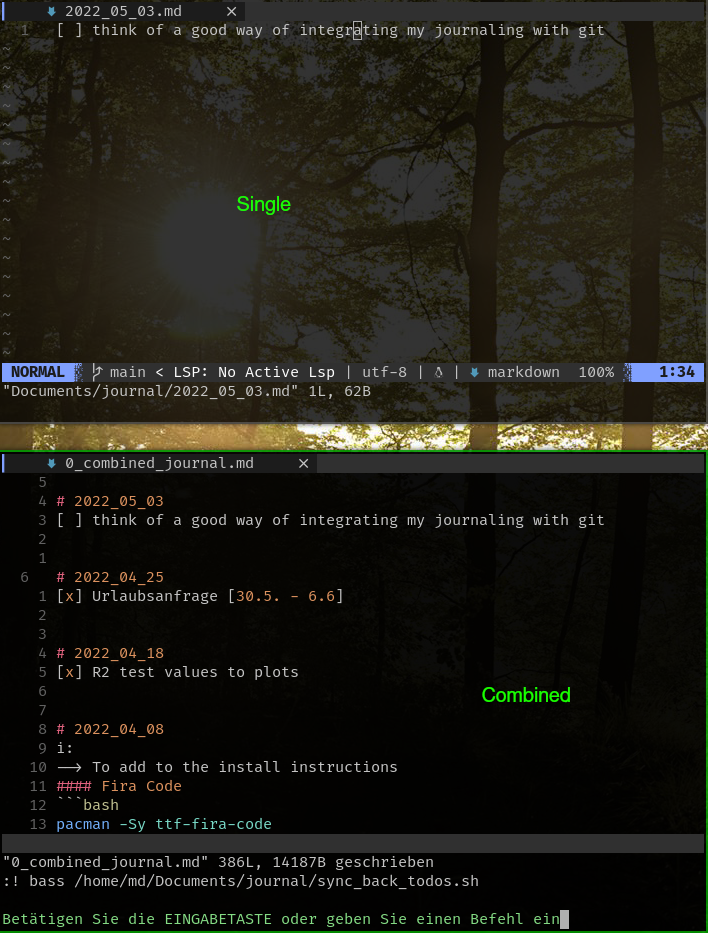

# Minjo
My minimal journalling setup, making use of plain mardown files and scratchpads integrated in [dwm](https://dwm.suckless.org/).
The idea is to keep it as alightweight and minimal as possible.
]

### Workflow
With my current setup, I do have the following functionality:
* Alt+n opens a scratchpad with neovim which starts in a markdown filte at `~/Documents/journal/$(date +%Y_%m_%d).md`. If the file does not yet exist, it will be created.
* Alt+N opens a scratchpad with neovim, which first calles `combine_journals.sh` to create a single markdown containig content from all others and then opens the resulting file at `~/Documents/journal/0_combined_journal.md`. This makes it easy to search and navigate the file with neovim. If a checkbox is filled e.g. `[ ]` --> `[x]`, this is synced back to the original single file upon saving the file.

### Setup
This is still a lot manual and requires the following:

1) get the scripts to the journal folder (or tweek all the pathing)
```bash
mkdir ~/Documents/journal
cp *.sh ~/Documents/journal

# symlinks to have the scripts executeable or add them to a directory in path
ln -s ~/Documents/journal/open_journal.sh ~/.local/bin/
ln -s ~/Documents/journal/combine_and_open_combined_journal.sh ~/.local/bin/
```

2) Setup the scratchpads in `dwm/config.h`
```c
const char *spcmd1[] = {"st", "-n", "spterm", "-g", "120x34", "-e", "/home/md/.local/bin/open_journal.sh", NULL };
const char *spcmd2[] = {"st", "-n", "spfm", "-g", "144x41", "-e", "ranger", NULL };
const char *spcmd3[] = {"keepassxc", NULL };
const char *spcmd4[] = {"st", "-n", "spterm", "-g", "120x34", "-e", "/home/md/.local/bin/combine_and_open_combined_journal.sh", NULL };
```

3) Enable the sync-back on saving the vim buffer
```vim
autocmd BufWritePost 0_combined_journal.md :! bass /home/md/Documents/journal/sync_back_todos.sh
```

And that should be it :)


